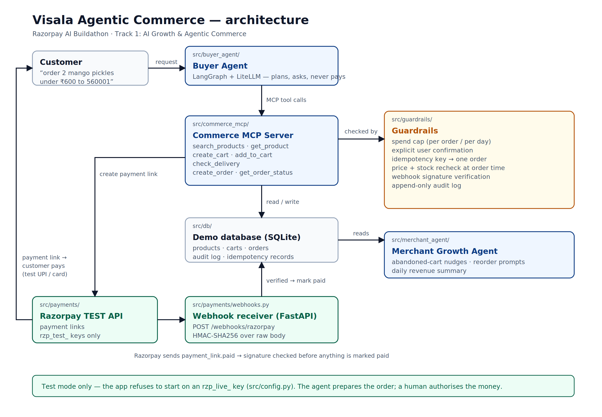

# Visala Agentic Commerce

> Makes a real D2C food store buyable by AI agents — safely — on Razorpay.

Submission for the **Razorpay AI Buildathon — Track 1: AI Growth & Agentic Commerce**.


**Pitch video:** _TODO: link_

---

## The problem

_TODO (2-3 sentences): customers increasingly ask AI assistants to do things for them, but a
merchant's app/website is built for humans. For an agent to transact, the merchant needs a
machine-readable storefront plus guardrails so an autonomous agent cannot misbuy, double-charge,
or be tricked._

## What this is

A commerce **MCP server** that exposes a real store (Visala Home Foods) as agent-callable tools,
plus a **buyer agent** that turns "order 2 mango pickles under Rs.600, delivered Saturday" into a
real Razorpay order — with a human approving the payment.

## Architecture



_TODO: 5 lines explaining the diagram._

## Results

_TODO: paste the table from `evals/results/latest.md` here after running `make eval`._

| Metric | Result |
|---|---|
| Task success rate | — |
| Correct refusal rate | — |
| Duplicate orders | — |
| Guardrail violations | — |
| Avg latency / order | — |
| Avg LLM cost / order | — |

## Guardrails

| Guardrail | Prevents |
|---|---|
| Spend cap (per order, per user per day) | Runaway spending by an agent |
| Explicit user confirmation before `create_order` | Buying without consent |
| Idempotency key per order | Duplicate orders on retry |
| Webhook signature verification | Forged "payment succeeded" calls |
| Price + stock recheck at order time | Charging a stale price |
| Audit log of every tool call | Unexplainable agent behaviour |

## Quickstart

```bash
git clone <repo-url> && cd visala-agentic-commerce
cp .env.example .env          # add your own Razorpay TEST keys
make setup
make demo                     # places an order end to end
make eval                     # runs the scenario suite
```

> **Test mode only.** The app refuses to start with an `rzp_live_` key. No real money moves.

## Design decisions

See [docs/decisions.md](docs/decisions.md).

## Limitations & what's next

_TODO: be honest here — it earns trust._

## Author

Sankar Sriram — [GitHub](https://github.com/Sank19-code)
